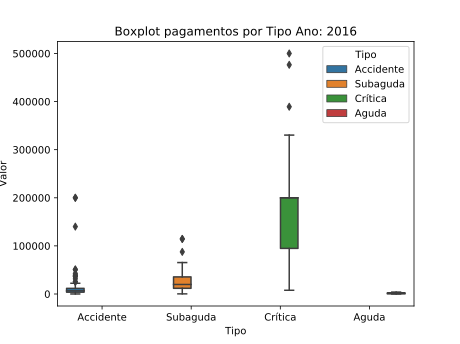

# Projeto Insurance Health ITAM

## Descrição
Explorando os dados de seguro saúde disponíveis no [Kaggle](https://www.kaggle.com/omartronco/health-insurance-data), criado e disponbilizado aos estudantes de Actuarial Science at ITAM (Mexico).

Segundo a descrição, os dados estão relacionados ao seguro de saúde para um grupo de apólices de seguro. Este conjunto de dados também inclui cobertura de acidentes. Embora as doenças sejam difíceis de classificar, esse conjunto de dados é dividido em 3 tipos: agudo, subagudo e crônico. O grupo possui 5 tipos de segurados, cada grupo com diferentes modificações de cobertura.

## Target, ideias e implementações

- [x] Upar dados no sqlite
- [x] Montar tabela de probabilidade por número de sinistros
- [x] Montar tabela de soma de sinistros por ano, agrupadas por grupo
- [x] Montar tabela de soma de sinistros por ano, agrupadas por grupo e tipo
- [x] Carregar os dados do banco para o python
- [ ] Exploração dos dados e gráficos
- [ ] Cálculo do prêmio médio de risco para o ano de 2019

## Exploração dos dados

