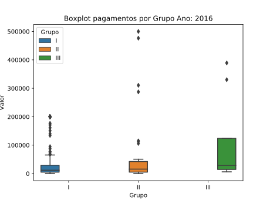

# Projeto Insurance Health ITAM

## Descrição
Explorando os dados de seguro saúde disponíveis no [Kaggle](https://www.kaggle.com/omartronco/health-insurance-data), criado e disponbilizado aos estudantes de Actuarial Science at ITAM (Mexico).

 
Segundo a descrição, os dados estão relacionados ao seguro de saúde para um grupo de apólices de seguro. Este conjunto de dados também inclui cobertura de acidentes. Embora as doenças sejam difíceis de classificar, esse conjunto de dados é dividido em 3 tipos: agudo, subagudo e crônico. O grupo possui 5 tipos de segurados, cada grupo com diferentes modificações de cobertura.

## Target, ideias e implementações

- [x] Upar dados no sqlite
- [x] Montar tabela de probabilidade por número de sinistros
- [x] Montar tabela de soma de sinistros por ano, agrupadas por grupo
- [x] Montar tabela de soma de sinistros por ano, agrupadas por grupo e tipo
- [x] Carregar os dados do banco para o python
- [x] Exploração dos dados e gráficos 
- [ ] Acrescentar texto decente na exploração dos dados
- [ ] Acrescentar média de valores pagos por tipo e grupo de claim via sql
- [ ] Cálculo do prêmio médio de risco para o ano de 2019

## Exploração dos dados

 
Analisando os dados, verificamos as seguintes informações:

### Distribuição da quantidade de reclamações por segurado

### Boxplot dos valores de indenizações por grupo

### Boxplot dos valores de indenizações por tipo

### Indenizações por ano e grupo

### Indenizações por ano e tipo

